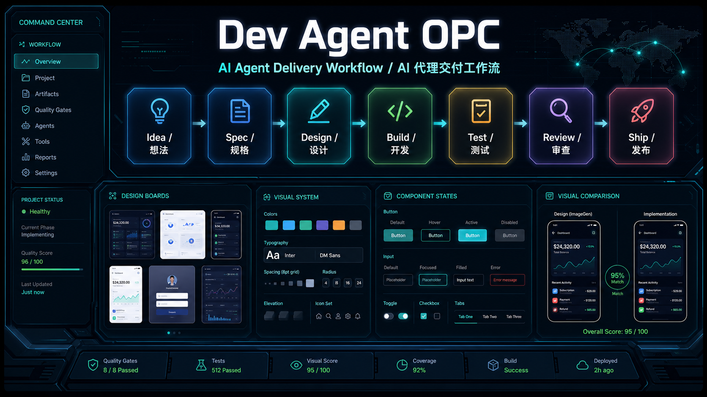

<p align="center">
  
</p>

<h1 align="center">Dev Agent OPC</h1>

<p align="center">
  <strong>面向 AI Coding Agent 的可验证交付工作流</strong>
  <br>
  <strong>Verifiable Delivery Workflow for AI Coding Agents</strong>
</p>

<p align="center">
  <a href="#中文">中文</a>
  · <a href="#english">English</a>
  · <a href="#快速开始">快速开始</a>
  · <a href="#quick-start">Quick Start</a>
</p>

<p align="center">
  <a href="#发布状态"></a>
  <a href="LICENSE"></a>
  <a href="agent-skills/"></a>
  
  
</p>

<p align="center">
  Created and maintained by <strong>Kevin KE / laoke.ai</strong>, worked with <strong>Codex-5.5</strong>.
  <br>
  由 <strong>Kevin KE / laoke.ai</strong> 创建和维护，并与 <strong>Codex-5.5</strong> 协作完成。
</p>

---

## 中文

### 项目定位

**Dev Agent OPC** 是一套面向 AI Coding Agent 的本地交付流程框架。它把产品定义、
Agent 流程设计、技术规格、UI 设计、实现、测试、审查和发布收敛到同一个可恢复、
可验证、可交接的工作流中，让 Agent 不只是写代码，而是围绕明确产物和质量门禁持续推进。

这个项目适合用于维护可复用的 Agent 工作方式：每个运行项目都放在 `work/<project-name>/`
下，根目录保持干净；核心工作流保存在 `agent-skills/`；`bin/dev-flow` 负责项目状态、
阶段检查、UI 质量门禁、PDCA 交接和适配器打包。对于需要精美界面或完整交付物的任务，
流程会要求先完成设计图和视觉规范，再进入开发和验证。

### 快速开始

#### 推荐方式：把 GitHub 地址交给你的大模型

复制这个仓库地址，直接发给你的大模型或 Coding Agent，让它按这个 agent 工作流安装或执行：

```text
请使用这个 GitHub 仓库作为我的 AI Coding Agent 交付工作流：
https://github.com/KevinKE93/Dev_Agent_OPC

请先读取仓库里的 AGENTS.md 和 DEV_FLOW.md，再根据当前任务选择合适的
agent-skills/skills、agent-skills/agents、agent-skills/references。

如果你的运行环境支持安装，请把它安装成可复用的 agent workflow；
如果不支持安装，就临时按照这个仓库的工作流执行本次任务。
执行时不要跳过 spec、design、plan、build、test、review、ship 中适用的质量门禁。
```

如果是 UI 项目，可以这样补一句：

```text
本次任务使用 ui flow。设计阶段必须先有 approved design assets；
如果使用 imagegen/GPT Image 生成设计图，请同时生成 HTML 语义描述；
如果使用 Figma，请记录 Figma handoff。通过 design/QA/PDCA 门禁后再交付。
```

#### 其他用法

- 临时引用：让模型读取 `AGENTS.md`、`DEV_FLOW.md` 和当前需要的 `agent-skills/` 文件，不做安装。
- 全局安装：在本仓库内运行 `bin/dev-flow install <host> --scope user`。
- 项目安装：在本仓库内运行 `bin/dev-flow install <host> --scope project`。
- 只跑某个阶段：指定 `idea`、`pm`、`agent`、`spec`、`design`、`figma-design`、`plan`、`build`、`test`、`review` 或 `ship`。

支持的 host 名称：`codex`、`claude-code`、`gemini`、`openclaw`、`opencode`。
项目类型可以指定为 `ui`、`agent`、`api`、`library` 或 `docs`。

```bash
bin/dev-flow install codex --scope user
bin/dev-flow install claude-code --scope user
```

修改流程包本身后，再运行仓库 smoke test。

### 交付流程

| 阶段 | 命令 | 主要产物 |
|---|---|---|
| 想法 | `idea` / `/idea` | 聚焦后的 idea brief |
| 产品 | `pm` / `/pm` | PRD、用户故事、指标、验收标准 |
| Agent 流程 | `agent` / `/agent` | 工具、权限、提示词、恢复机制、评估 |
| 规格 | `spec` / `/spec` | 可构建的产品和技术规格 |
| 设计 | `design` / `/design` | UX、视觉系统、屏幕验收标准、正式设计资产 |
| Figma 设计稿 | `figma-design` | 将视觉方向沉淀为 Figma frame 和正式导出图 |
| Figma 组件库 | `figma-library` | 可选的 tokens、组件变体和设计系统 |
| 计划 | `plan` / `/plan` | 小粒度、可验证的实现任务 |
| 开发 | `build` / `/build` | 带证据的实现切片 |
| 测试 | `test` / `/test` | 测试和回归证据 |
| 审查 | `review` / `/review` | 结构化质量审查 |
| 发布 | `ship` / `/ship` | 发布说明、go/no-go、回滚计划 |

阶段推进默认会检查此前适用阶段。`bin/dev-flow phase` 只记录状态，不代表对应工作已经完成。

### UI 与交付门禁

面向用户的 UI 任务需要先通过 reference/design/approved-assets 阶段，再进入实现。设计阶段会产出
`DESIGN.md`、`VISUAL_SYSTEM.md`、`SCREEN_ACCEPTANCE.md`、`DESIGN_ARTIFACTS.md`
和 `design/approved/` 下的正式布局图或状态图；实现后需要记录功能测试、monkey 测试和视觉对比评分。正常 QA
不要求截图，只有异常或流程阻塞时才需要截图证据。
`design/approved/` 的正式设计资产只能来自 imagegen/GPT Image raster/PDF 输出、Figma MCP 或 Figma 导出、设计师上传或 uploaded-approved 文件、已建立设计系统的导出板、或带来源证据的外部设计工具导出。
如果 imagegen/GPT Image 生成正式设计图，需要同步生成 `design/approved/html/` 下的 HTML 语义描述，并在 `DESIGN_IMAGE_DESCRIPTIONS.md` 与 `DESIGN_ARTIFACTS.md` 中记录映射，帮助后续 Figma 或开发理解图片里的布局、组件、状态和视觉规则。
如果用 imagegen/GPT Image 探索方向后再进入 Figma，需要在 `design/FIGMA_HANDOFF.md` 记录 Figma file/node 和正式导出图的映射，并在 `DESIGN_ARTIFACTS.md` 中使用 `figma` 或 `figma-mcp` 作为 Source type。
浏览器、Playwright、模拟器、本地 HTML/CSS、运行态截图、草图和原型图不能作为开发实现目标；自行生成的 SVG/XML 草图不能放入 `design/approved/` 作为正式设计图。SVG 可以作为元素素材放在 `design/cut-assets/`，但必须有 manifest，并且只能作为图标、标识、插画片段等运行时素材，不能作为界面布局参考。
如果没有外部参考而由 Agent 负责视觉方向，需要写入 `design/REFERENCE_BOARD.md`。切图资产、透明 PNG、图标矩阵、spritesheet 或动画帧需要提供 manifest；如果不需要切图，也要显式记录原因。
进入开发计划前，`tasks/IMPLEMENTATION_TRACE.md` 需要把每个界面映射到实现目标、正式设计图、设计来源、必要的 HTML companion、切图资产和测试证据。

```bash
bin/dev-flow reference-check my-project --required
bin/dev-flow design-check my-project
bin/dev-flow asset-check my-project       # optional focused diagnostic
bin/dev-flow figma-check my-project       # optional focused diagnostic when Figma-backed
bin/dev-flow qa-check my-project
```

交付前必须补齐 `tasks/PDCA.md`。它记录当前周期、Plan、Do、Check、Act，确保决策、
证据、回滚和下一轮迭代不会丢失。

```bash
bin/dev-flow pdca-check my-project
bin/dev-flow ship-check my-project
```

### 仓库结构

```text
agent-skills/
  skills/          Canonical SKILL.md workflows
  agents/          Specialist agent personas
  commands/        Command prompts for agent hosts
  references/      Shared checklists, rubrics, and workflow references
  templates/       Project templates rendered by bin/dev-flow init/migrate
  lib/             Internal helpers for the local dev-flow runtime
  .claude/         Claude Code command files
  .gemini/         Gemini CLI command files
assets/            README and project media assets
bin/dev-flow       Local workflow CLI
docs/              Maintainer docs for execution logic and call relationships
DEV_FLOW.md        Detailed workflow documentation
AGENTS.md          Repository instructions for agents
work/              Runtime project state, created on demand and ignored by git
```

干净 checkout 中默认不需要 `work/`。只有运行 `bin/dev-flow init <project-name>` 时才会创建。

### 适配器

```bash
bin/dev-flow install <host> --scope user
bin/dev-flow install <host> --scope project
bin/dev-flow package-adapters
```

生成的适配器目录属于构建输出，应从 `agent-skills/` 重新生成，不应手动编辑。adapter
目录提供规则提示层；`package-adapters` 额外生成 `runtime/`，包含 `bin/dev-flow`、模板和 smoke test，用于需要可执行门禁的平台用户。

### 发布状态

`v0.2` 增加了结构化门禁、项目模板、runtime 打包、doctor/migrate 检查和更严格的设计资产合约。
`main` 用于发布，`dev` 用于默认迭代；发布标签使用 `vX.Y` 格式，提交信息建议使用
Conventional Commits。

---

## English

### Project Positioning

**Dev Agent OPC** is a local delivery workflow framework for AI coding agents.
It brings product definition, agent workflow design, technical specification,
UI design, implementation, testing, review, and launch into one recoverable and
verifiable operating model.

The goal is to make agent work shippable. Runtime projects live under
`work/<project-name>/`, the reusable workflow source lives in `agent-skills/`,
and `bin/dev-flow` coordinates state, gates, UI quality checks, PDCA handoff,
and adapter packaging. For interface-heavy work, the flow requires design boards
and visual standards before implementation begins.

### Quick Start

#### Recommended: Give The GitHub URL To Your Model

Copy this repository URL into your large model or coding agent and ask it to
install or follow this workflow:

```text
Use this GitHub repository as my AI Coding Agent delivery workflow:
https://github.com/KevinKE93/Dev_Agent_OPC

First read AGENTS.md and DEV_FLOW.md, then load only the relevant
agent-skills/skills, agent-skills/agents, and agent-skills/references.

If your environment supports installation, install it as a reusable agent
workflow. If not, follow the repository workflow temporarily for this task.
Do not skip applicable quality gates across spec, design, plan, build, test,
review, and ship.
```

For UI work, add:

```text
Use the ui flow. Design must include approved design assets before build.
If imagegen/GPT Image creates design images, generate semantic HTML companions
at the same time. If Figma is used, record the Figma handoff. Deliver only
after design, QA, and PDCA gates pass.
```

#### Other Usage

- Temporary reference: ask the model to read `AGENTS.md`, `DEV_FLOW.md`, and the
  relevant `agent-skills/` files without installing anything.
- User install: run `bin/dev-flow install <host> --scope user`.
- Project install: run `bin/dev-flow install <host> --scope project`.
- Single phase: request `idea`, `pm`, `agent`, `spec`, `design`,
  `figma-design`, `plan`, `build`, `test`, `review`, or `ship`.

Supported hosts are `codex`, `claude-code`, `gemini`, `openclaw`, and
`opencode`. Project types are `ui`, `agent`, `api`, `library`, and `docs`.

```bash
bin/dev-flow install codex --scope user
bin/dev-flow install claude-code --scope user
```

After changing the workflow pack itself, run the repository smoke test.

### Delivery Flow

| Stage | Command | Primary artifact |
|---|---|---|
| Idea | `idea` / `/idea` | Focused idea brief |
| Product | `pm` / `/pm` | PRD, stories, metrics, acceptance |
| Agent Flow | `agent` / `/agent` | Tools, permissions, prompts, recovery, evals |
| Spec | `spec` / `/spec` | Buildable product and technical spec |
| Design | `design` / `/design` | UX, visual system, screen acceptance, approved design assets |
| Figma Design | `figma-design` | Formalized Figma frames and approved exports |
| Figma Library | `figma-library` | Optional Figma tokens/components library |
| Plan | `plan` / `/plan` | Small verifiable tasks |
| Build | `build` / `/build` | Implemented slices with proof |
| Test | `test` / `/test` | Tests and regression evidence |
| Review | `review` / `/review` | Structured quality review |
| Ship | `ship` / `/ship` | Launch notes, go/no-go, rollback plan |

Phase changes verify prior applicable phases by default. `bin/dev-flow phase`
records state only; it does not replace the work itself.

### Quality Gates

Customer-facing UI work must pass reference intake, design checks, and approved
design asset coverage before implementation. After implementation, QA records functional
tests, monkey testing, and visual comparison. Screenshots are required only for
exceptions or blocked flows.
Final assets under `design/approved/` must come from a formal producer and be
recorded in `DESIGN_ARTIFACTS.md`: imagegen/GPT Image raster output, Figma MCP
or Figma exports, designer uploads, uploaded-approved files, design-system board
exports, or external design-tool exports stored under `design/sources/approved/`.
Manual/local SVG or HTML rendering, browser screenshots, canvas captures, and
runtime screenshots are not formal producers, even if the final file is PNG.
When imagegen/GPT Image creates final design images, generate semantic HTML
companions under `design/approved/html/` and map them in
`DESIGN_IMAGE_DESCRIPTIONS.md` plus `DESIGN_ARTIFACTS.md`; this gives Figma or
implementation agents a structured description of layout, components, states,
and visual rules instead of relying only on bitmap interpretation.
Figma-backed assets also require `design/FIGMA_HANDOFF.md` and
`bin/dev-flow figma-check <project-name>`.
Browser, Playwright, simulator, local HTML/CSS, runtime screenshots, drafts, and
prototypes are not substitutes for approved design assets, and SVG/XML sketches
must not be stored under `design/approved/`. SVG files may be stored under
`design/cut-assets/` only as manifested element/runtime assets, not as screen
layout references. SVG cut assets, transparent PNGs, icon matrices, spritesheets, and animation frames need a
manifest; when none are needed, the design record must say so. Delegated visual
direction requires `design/REFERENCE_BOARD.md`, and UI build planning requires
`tasks/IMPLEMENTATION_TRACE.md`.

```bash
bin/dev-flow reference-check my-project --required
bin/dev-flow design-check my-project
bin/dev-flow asset-check my-project       # optional focused diagnostic
bin/dev-flow figma-check my-project       # optional focused diagnostic when Figma-backed
bin/dev-flow qa-check my-project
```

Before delivery, complete `tasks/PDCA.md` and run the final gates:

```bash
bin/dev-flow pdca-check my-project
bin/dev-flow ship-check my-project
```

### Repository Layout

```text
agent-skills/
  skills/          Canonical SKILL.md workflows
  agents/          Specialist agent personas
  commands/        Command prompts for agent hosts
  references/      Shared checklists, rubrics, and workflow references
  templates/       Project templates rendered by bin/dev-flow init/migrate
  lib/             Internal helpers for the local dev-flow runtime
  .claude/         Claude Code command files
  .gemini/         Gemini CLI command files
assets/            README and project media assets
bin/dev-flow       Local workflow CLI
docs/              Maintainer docs for execution logic and call relationships
DEV_FLOW.md        Detailed workflow documentation
AGENTS.md          Repository instructions for agents
work/              Runtime project state, created on demand and ignored by git
```

`work/` is intentionally absent from a clean checkout and is created only when
`bin/dev-flow init <project-name>` runs.

### Adapters

```bash
bin/dev-flow install <host> --scope user
bin/dev-flow install <host> --scope project
bin/dev-flow package-adapters
```

Generated adapter directories are build output. Regenerate them from
`agent-skills/` instead of editing them by hand. Adapter folders provide the
rules prompt layer; `package-adapters` also emits `runtime/` with `bin/dev-flow`,
templates, and smoke tests for users who need executable gates.

### Release Status

`v0.2` adds structured workflow gates, project templates, runtime packaging,
doctor/migrate checks, and stricter design asset contracts. `main` is used for
releases and `dev` is the default iteration branch. Release tags use the
`vX.Y` format, and commit messages should follow Conventional Commits.

---

## Based On

Dev Agent OPC builds on [Addy Osmani's `agent-skills`](https://github.com/addyosmani/agent-skills)
and adds a project-local workflow layer, product-management flow, AI-agent
product flow, visual quality gates, PDCA delivery evidence, adapter packaging,
and OpenClaw-oriented installation support.

## License

MIT. See [`LICENSE`](LICENSE).
