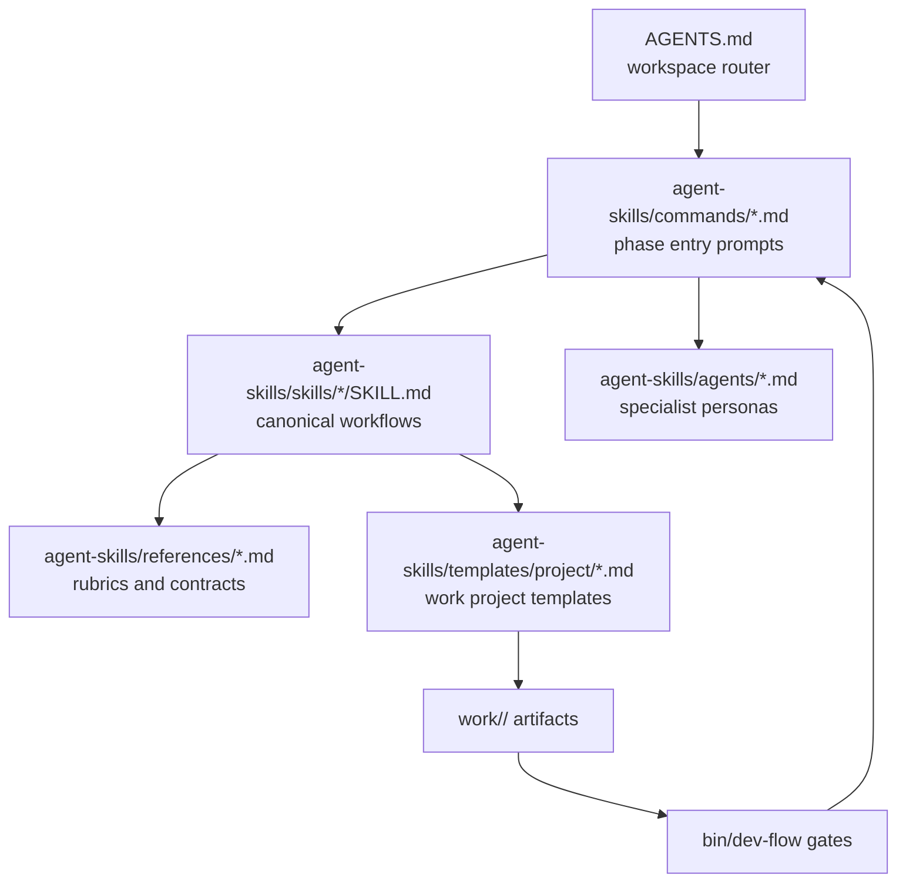

# Agent / Markdown Simplification Audit

本文按四条工作原则审计当前 Dev_Agent_OPC 的 Agent、command、skill、template、reference 文档：

1. 编码前思考：明确假设、歧义、权衡和停顿点。
2. 简洁优先：保留能改变执行结果的规则，减少重复描述。
3. 精准修改：只改 canonical source，不手工追改生成副本。
4. 目标驱动执行：把指令转成可验证 gate 和成功标准。

## 当前 Agent 结构



| Layer | Current role | Keep as source of truth? | Simplification stance |
|---|---|---:|---|
| `AGENTS.md` | Workspace routing, lifecycle, hard local rules | Yes, but concise | Keep only non-negotiable local rules and command map. |
| `agent-skills/commands/*.md` | Short phase entry prompts | Yes | Keep as thin wrappers. Avoid repeating long contracts. |
| `agent-skills/skills/*/SKILL.md` | Canonical workflow behavior | Yes | Keep detailed workflow, but move reusable contracts into references. |
| `agent-skills/agents/*.md` | Single-perspective personas | Yes | Keep role, scope, output. Avoid full artifact schemas. |
| `agent-skills/references/*.md` | Shared contracts/checklists | Yes | Best place for formal design/QA/PDCA contracts. |
| `agent-skills/templates/project/*.md` | Initial project artifact shape | Yes | Keep minimal schema and notes only. |
| `agent-skills/.claude/commands/*`, `.gemini/commands/*` | Host adapter copies | No | Treat as generated or adapter-specific wrappers only. Current copies drift. |
| `DEV_FLOW.md`, `README.md`, `docs/*` | Human docs and maintainer maps | No for runtime behavior | Describe, do not duplicate enforcement wording. |

## Current Personas

| Persona | Current job | Needed? | Redundancy risk |
|---|---|---:|---|
| `product-designer` | Customer-facing UX, references, screen acceptance, approved design artifacts, Figma handoff | Yes | Repeats `design-flow` artifact checklist. Can shrink to role judgment and output expectations. |
| `ui-quality-reviewer` | Functional QA, monkey testing, visual comparison, exception screenshots | Yes | Mostly concise. Keep. |
| `code-reviewer` | Five-axis code review | Yes | Fine. |
| `security-auditor` | Threat/vulnerability review | Yes | Fine. |
| `test-engineer` | Test strategy and coverage gaps | Yes | Fine. |

No new persona is needed for the current workflow. A meta-orchestrator persona would be redundant because `AGENTS.md`, commands, and `bin/dev-flow next` already route phases.

## Main Findings

### 1. Design Rules Are Repeated Too Widely

The same design contract appears in:

- `AGENTS.md`
- `DEV_FLOW.md`
- `agent-skills/commands/design.md`
- `agent-skills/commands/build.md`
- `agent-skills/commands/ui.md`
- `agent-skills/skills/design-flow/SKILL.md`
- `agent-skills/skills/frontend-ui-engineering/SKILL.md`
- `agent-skills/agents/product-designer.md`
- `agent-skills/templates/project/reference-intake.md`
- `agent-skills/templates/project/design-artifacts.md`
- `agent-skills/templates/project/quality-gates.md`
- `agent-skills/references/design-artifacts.md`

This was useful while hardening the design workflow, but it now creates drift risk. The SVG distinction fix already showed the problem: every new nuance must be propagated across many files.

Recommended target:

- Put the full formal design source contract only in `agent-skills/references/design-artifacts.md`.
- Let `design-flow` say: load that reference and satisfy its contract.
- Let `commands/design.md`, `commands/build.md`, and `commands/ui.md` use short gate language only.
- Let templates show expected tables without restating every prohibition.

### 2. Host Adapter Commands Have Drifted

`agent-skills/.claude/commands/*.md` and `agent-skills/.gemini/commands/*.toml` are not aligned with `agent-skills/commands/*.md`.

Examples:

- Some adapter design commands still mention broader source wording such as manual design-system comps.
- Some adapter design commands still describe cut assets as bitmap-only and forbid SVG cut assets.
- `ship` adapter commands contain long host-specific orchestration text that is not mirrored in the neutral command.

This is the clearest logic risk. An agent using the adapter command can follow stale rules even when the canonical command has been fixed.

Recommended target:

- Treat `agent-skills/commands/*.md` as canonical.
- Generate adapter commands from canonical content plus a small host-specific preface.
- If generation is not implemented yet, manually sync only the stale adapter files as a short-term repair.

### 3. Commands Should Be Thin

Commands currently do two jobs:

- trigger the right skill;
- repeat detailed workflow rules.

That makes them convenient to read in isolation, but it violates "简洁优先" and increases drift.

Recommended command shape:

```markdown
Invoke `<skill>`.
Read the current project context.
Produce the expected artifact.
Run the named gate.
If the gate fails, return to the owning phase.
```

Detailed schemas should live in references/templates, not in every command.

### 4. Skills Should Own Workflow, References Should Own Contracts

`design-flow` and `frontend-ui-engineering` are the heaviest hot-path skill docs. Their length is partly justified, but both repeat the same artifact contract.

Recommended split:

- `design-flow`: owns sequence, judgment, reference intake, design decisions.
- `references/design-artifacts.md`: owns formal source types, SVG rules, HTML companion mapping, Figma handoff, cut-asset manifest.
- `frontend-ui-engineering`: owns implementation from approved assets and QA behavior.
- `references/visual-qa-rubric.md`: owns score matrix details.

### 5. Templates Should Be Schema, Not Policy

Templates should help a project start with the right shape. They should not carry the full rulebook because copied templates become another place to update.

Keep in templates:

- headings;
- tables;
- required fields;
- one-line reminders.

Move out of templates:

- long source-provenance explanations;
- repeated screenshot/SVG/Figma prohibitions;
- narrative rationale.

### 6. Runtime Gates Are the Right Place for Hard Rules

The best current design is that important hard rules are executable in `bin/dev-flow`:

- `reference-check`
- `asset-check`
- `figma-check`
- `design-check`
- `qa-check`
- `pdca-check`
- `ship-check`

This matches "目标驱动执行". For rules that can be validated mechanically, prefer gate checks over Markdown repetition.

## Proposed Rule Hierarchy

Use this hierarchy to reduce conflict:

| Rule type | Authoritative location | Other files should do |
|---|---|---|
| Lifecycle order | `AGENTS.md`, `DEV_FLOW.md`, `bin/dev-flow next` | Link or summarize. |
| Phase workflow | `agent-skills/skills/*/SKILL.md` | Commands invoke it. |
| Artifact schema | `agent-skills/templates/project/*.md` | Skills reference it. |
| Formal design source contract | `agent-skills/references/design-artifacts.md` + `bin/dev-flow asset-check` | Mention gate, avoid restating full list. |
| Figma contract | `agent-skills/references/figma-handoff.md` + `bin/dev-flow figma-check` | Mention when to use. |
| QA scoring | `agent-skills/references/visual-qa-rubric.md` + `bin/dev-flow qa-check` | Mention score threshold. |
| PDCA contract | `agent-skills/references/pdca-delivery-loop.md` + `bin/dev-flow pdca-check` | Mention required update. |
| Host adapter syntax | generated adapter files | Never diverge in workflow logic. |

## Four-Principle Fit

### 编码前思考

Current state: partly good. Spec, plan, and design phases require thinking before build.

Gap:

- The four principles are not present as a compact universal rule at the command/skill entry point.
- Some commands jump straight into artifact production without explicitly requiring assumptions, alternatives, or stop conditions.

Recommended improvement:

- Add a short `WORKING_PRINCIPLES.md` reference or compact block in `AGENTS.md`.
- Commands should include one line: "State assumptions, alternatives, and blockers before editing."

### 简洁优先

Current state: mixed. `incremental-implementation` has strong simplicity rules, but many workflow docs are now too repetitive.

Gap:

- Design gate language repeats across too many files.
- Adapter commands are full copies instead of generated wrappers.

Recommended improvement:

- Shrink commands and personas.
- Move detailed repeated contracts into references.
- Add tests that compare adapter command freshness or generation.

### 精准修改

Current state: good in project layout rules, weaker in adapter maintenance.

Gap:

- Manual edits across neutral commands, Claude commands, Gemini commands, templates, references, and top-level docs invite broad churn.

Recommended improvement:

- Change canonical docs first.
- Regenerate adapters.
- Do not hand-edit generated project-scope outputs.

### 目标驱动执行

Current state: strong. Runtime gates are a real advantage.

Gap:

- Some Markdown rules are not backed by smoke tests.
- Drift between adapters and canonical commands is not checked.

Recommended improvement:

- Add smoke tests for adapter freshness or command generation.
- Convert any repeated non-negotiable policy into a gate when feasible.

## Suggested Simplification Tasks

### Task 1: Define Canonical Rule Boundaries

Create or update a short maintainer note that says:

- `agent-skills/commands` are canonical command prompts.
- `.claude` and `.gemini` command files are adapters.
- Design source contract lives in `references/design-artifacts.md`.
- Figma contract lives in `references/figma-handoff.md`.
- Gates enforce hard rules.

Success standard:

- A future change to SVG/Figma/imagegen rules has one obvious source file to edit.

### Task 2: Sync or Generate Adapter Commands

Fix stale `.claude` and `.gemini` command files, or add a generator that renders them from `agent-skills/commands`.

Success standard:

- No adapter command contains stale design source wording.
- SVG element assets under `design/cut-assets/` are allowed consistently.
- `manual-design` / `local-approved` are not reintroduced.

### Task 3: Shrink Commands

Reduce `commands/design.md`, `build.md`, and `ui.md` by replacing repeated contract detail with references to:

- `design-flow`
- `frontend-ui-engineering`
- `references/design-artifacts.md`
- `bin/dev-flow design-check` / `qa-check`

Success standard:

- Commands stay actionable in under roughly 10-14 lines each.
- Smoke tests still pass.

### Task 4: Shrink Product Designer Persona

Keep product-designer focused on judgment:

- UX problem;
- reference interpretation;
- screen acceptance;
- design decision quality;
- handoff completeness.

Move detailed artifact schema to `design-flow` and references.

Success standard:

- Persona remains under roughly 20 lines after frontmatter.
- It no longer repeats full design artifact contracts.

### Task 5: Template Cleanup

Keep templates as form fields and one-line reminders only.

Success standard:

- `reference-intake.md`, `design-artifacts.md`, and `quality-gates.md` do not duplicate paragraphs from references.
- Generated projects still pass `bin/dev-flow doctor`.

### Task 6: Add Drift Tests

Add smoke coverage for:

- adapter command freshness or generator output;
- no stale formal source names in adapters;
- SVG cut asset rule consistency;
- no duplicate root-level generated adapter installs.

Success standard:

- `tests/dev-flow-smoke.sh` fails if an adapter reintroduces stale design rules.

## Recommended Order

1. Fix adapter drift first because it can cause real wrong behavior.
2. Add drift tests.
3. Shrink commands.
4. Shrink product-designer.
5. Trim templates.
6. Only then consider trimming large skills.

Do not start with aggressive skill compression. The current skills encode useful anti-rationalization behavior; removing that before adapter drift is fixed would reduce safety without solving the real duplication source.

## First-Pass Implementation

The first cleanup pass should be considered complete when these are true:

- Adapter commands no longer contain stale design-source wording such as `manual-design`, `local-approved`, broad "explicitly approved source" language, or bitmap-only cut-asset rules.
- Neutral `design`, `build`, `ui`, and `plan` commands are thin phase prompts that point to canonical skills, references, and gates.
- `product-designer` describes design judgment and output expectations without duplicating the full artifact schema.
- Project templates keep field structure and short reminders while delegating formal policy to references and `bin/dev-flow` gates.
- `tests/dev-flow-smoke.sh` fails if adapter command drift reintroduces stale design-source or cut-asset rules.

## Second-Pass Implementation

The second cleanup pass trims the two longest hot-path skills without weakening
their gates:

- `design-flow` is now a workflow contract: it owns sequence, judgment,
  reference intake, formal design asset creation, Figma handoff timing, and
  design-check gating.
- `frontend-ui-engineering` is now an implementation contract: it owns
  preflight checks, implementation trace usage, approved asset handling,
  accessibility, batch completion, and QA evidence.
- Detailed schemas stay in `agent-skills/templates/project/`.
- Formal source rules stay in `agent-skills/references/design-artifacts.md` and
  `bin/dev-flow asset-check/design-check`.
- Figma handoff rules stay in `agent-skills/references/figma-handoff.md` and
  `bin/dev-flow figma-check`.
- Visual scoring detail stays in `agent-skills/references/visual-qa-rubric.md`
  and `bin/dev-flow qa-check`.

To keep the reduction durable, `tests/dev-flow-smoke.sh` now includes line
budgets for the highest-drift Markdown entry points:

- `design-flow/SKILL.md` <= 180 lines
- `frontend-ui-engineering/SKILL.md` <= 280 lines
- hot neutral commands <= 20 lines each
- `product-designer.md` <= 30 lines

This is intentionally not a universal documentation limit. It protects the files
that agents read most often, where repetition has the highest cost and the
highest drift risk.

## Third-Pass Implementation

The third cleanup pass moves from document compression to execution control:

- `bin/dev-flow next <project-name>` now returns a phase execution brief instead
  of only a short prompt alias and goal.
- The brief names the current project type, command file, primary skill files,
  minimal context to load, required outputs, blockers, gate commands, and the
  `phase` command to run after the gate passes.
- This makes `next` the fast path for continuing work: agents can load less
  context, avoid re-reading the full rulebook, and follow the same gate sequence
  every time.
- `tests/dev-flow-smoke.sh` now checks the UI design-phase brief so this control
  surface cannot silently regress to a vague prompt.

This is the preferred optimization direction from here: improve the executable
navigation layer first, then reduce or regenerate duplicated adapter text.
