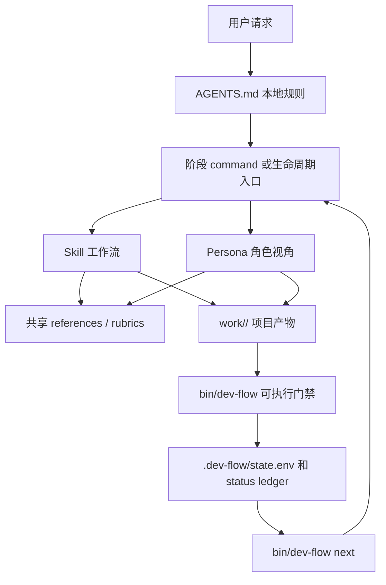
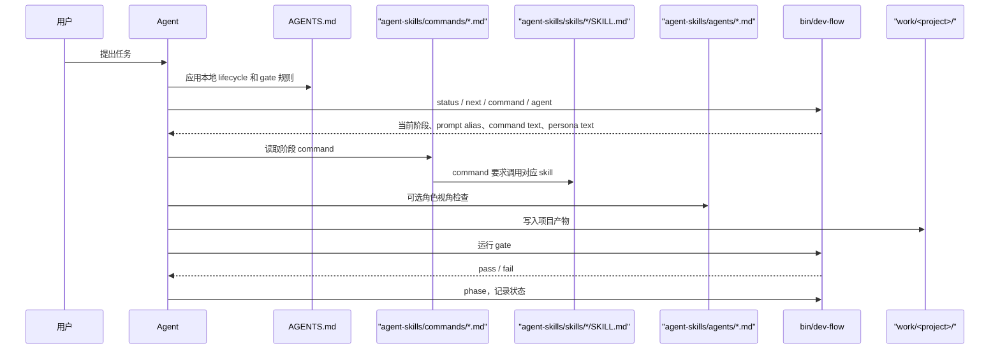
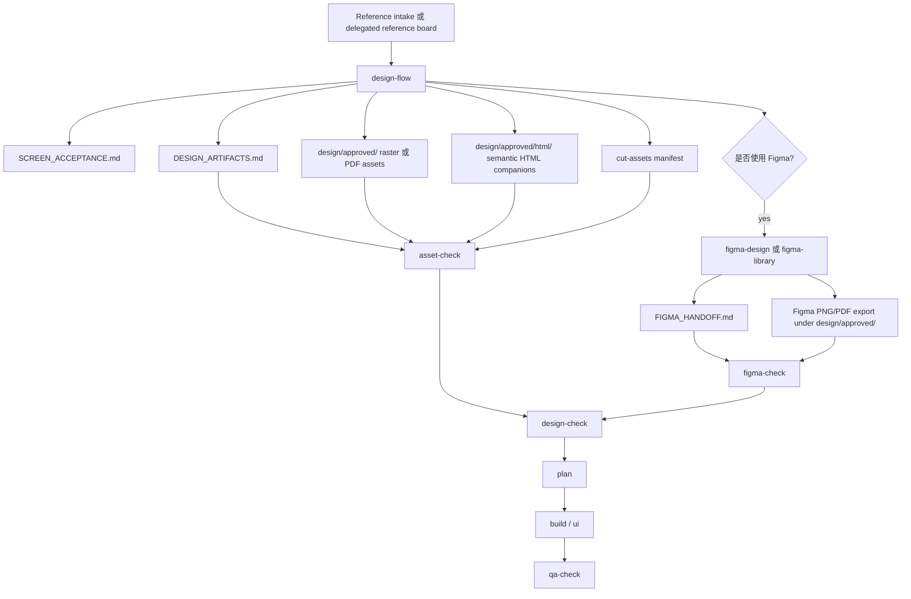

# Dev Flow 任务执行逻辑

本文档梳理 Dev_Agent_OPC 当前的任务执行链路、`AGENTS.md` 调度关系、
command 到 skill 的调用关系、persona 使用方式，以及 `bin/dev-flow` 的可执行
门禁逻辑。

## 总体模型

Dev_Agent_OPC 分成两层：

- Prompt / rules 层：`AGENTS.md`、`agent-skills/commands/`、
  `agent-skills/skills/`、`agent-skills/agents/`、
  `agent-skills/references/`。
- Runtime / gate 层：`bin/dev-flow`、`agent-skills/templates/project/`、
  `agent-skills/lib/dev-flow/`、项目运行目录 `work/<project>/`、测试脚本。

Prompt / rules 层负责告诉 agent “该怎么做”。Runtime / gate 层不替 agent 执行
skill 工作，只负责创建项目状态、报告下一步 prompt、记录阶段状态、校验产物是否
满足契约。



## 仓库内各层职责

| 路径 | 职责 | 是否执行代码 |
|---|---|---|
| `AGENTS.md` | 当前 workspace 的 agent 指令层，定义生命周期、技能加载、角色、门禁和产物规则。 | 否 |
| `DEV_FLOW.md` | 面向用户和维护者的 workflow 使用说明。 | 否 |
| `agent-skills/dev-agent.manifest.json` | native flow、role、gate 索引，供 `/dev agent` 和 `/dev-agent` 使用。 | 否 |
| `agent-skills/commands/` | 平台中立的 command prompt，例如 `design`、`build`、`figma-design`、`ship`。 | 否 |
| `agent-skills/skills/` | Canonical `SKILL.md` 工作流，定义步骤、输出和退出条件。 | 否 |
| `agent-skills/agents/` | 专家 persona prompt，例如 designer、reviewer、security auditor、test engineer。 | 否 |
| `agent-skills/references/` | 通用 rubric、checklist、编排原则、设计产物规则、Figma handoff 规则。 | 否 |
| `agent-skills/templates/project/` | `init` / `migrate` 渲染到 `work/<project>/` 的项目模板。 | 否 |
| `agent-skills/lib/dev-flow/` | `bin/dev-flow` 使用的 shell helper，例如 project type 和模板渲染。 | 通过 `bin/dev-flow` 执行 |
| `bin/dev-flow` | 本地 CLI：检查 pack、初始化项目、维护状态、检查宿主机环境合同、执行门禁、打包/安装 adapter。 | 是 |
| `tests/dev-flow-smoke.sh` | CLI、模板、门禁和 adapter 假设的回归 smoke test。 | 是 |
| `work/<project>/` | 项目运行状态、产物、源码、review 和 launch 证据。默认被 git 忽略。 | 取决于具体项目 |

## 标准任务执行流程

一轮完整执行通常按下面的 loop 运行：

1. 初始化项目：
   `bin/dev-flow init <project-name> --type <ui|agent|api|library|docs>`。
2. 每次恢复工作时读取状态：
   `bin/dev-flow status <project-name>` 和 `bin/dev-flow next <project-name>`。
3. 使用 `next` 返回的 phase execution brief：prompt alias、command file、
   skill files、最小上下文、必需产物、blockers、gate 和通过后的 `phase`
   命令。
4. 按 brief 和 `work/<project>/.dev-flow/context.md` 只加载当前阶段需要的上下文。
5. 读取对应 command：`agent-skills/commands/<name>.md`。
6. 按 command 中的说明调用对应 skill 或组合 skill。
7. 将产物写入 `work/<project>/` 下对应目录。
8. 运行对应 gate，例如 `verify-phase`、`design-check`、`figma-check`、
   `env-check`、`qa-check`、`pdca-check`、`ship-check`。
9. gate 通过后，用 `bin/dev-flow phase <project-name> <phase> [task]` 记录
   状态。
10. 重复上述过程，直到 `ship-check` 通过。

关键点：`bin/dev-flow phase` 只记录状态，不执行该阶段的 skill 工作。默认情况下，
它会先验证所有 prior applicable phases；只有明确使用 `--force` 时才跳过这个保护。

## 阶段顺序

当前状态机顺序是：

```text
idea -> pm -> agent -> spec -> design -> plan -> build -> test -> review -> ship
```

`idea`、`spec`、`plan`、`build`、`test`、`review`、`ship` 总是适用。
`pm`、`agent`、`design` 会受项目类型、applicability 配置、已有产物影响。

| 阶段 | 主 command | 主 skill | 主要输出 |
|---|---|---|---|
| `idea` | `agent-skills/commands/idea.md` | `idea-refine` | `ideas/idea-brief.md` |
| `pm` | `agent-skills/commands/pm.md` | `pm-flow` | `product/PRD.md`、`USER_STORIES.md`、`ACCEPTANCE.md`、`METRICS.md` |
| `agent` | `agent-skills/commands/agent.md` | `agent-flow` | `agent/AGENT_SPEC.md`、`WORKFLOW.md`、tools、prompts、evals、ops |
| `spec` | `agent-skills/commands/spec.md` | `spec-driven-development` | `specs/SPEC.md` |
| `design` | `agent-skills/commands/design.md` | `design-flow` | `DESIGN.md`、`VISUAL_SYSTEM.md`、`SCREEN_ACCEPTANCE.md`、`DESIGN_ARTIFACTS.md`、AI image HTML companions、approved assets |
| `figma-design` | `agent-skills/commands/figma-design.md` | Figma plugin skills when available | Figma screen frames、`design/approved/screens/` 导出、`FIGMA_HANDOFF.md` |
| `figma-library` | `agent-skills/commands/figma-library.md` | Figma plugin skills when available | Figma tokens/components、`design/approved/components/` 导出、`FIGMA_HANDOFF.md` |
| `plan` | `agent-skills/commands/plan.md` | `planning-and-task-breakdown` | `tasks/PLAN.md`、`tasks/IMPLEMENTATION_TRACE.md`、PDCA Plan |
| `build` | `agent-skills/commands/build.md` | `incremental-implementation`、`test-driven-development` | `apps/` 或 `packages/` 下源码、PDCA Do |
| `test` | `agent-skills/commands/test.md` | `test-driven-development` | 验证证据、PDCA Check |
| `review` | `agent-skills/commands/review.md` | `code-review-and-quality` | `reviews/REVIEW.md` |
| `ship` | `agent-skills/commands/ship.md` | `shipping-and-launch` | `ship/LAUNCH.md`、PDCA Act、go/no-go 决策 |

`figma-design` 和 `figma-library` 是 design 阶段内的子流程，不是
`bin/dev-flow phase` 的状态机阶段。

Native 入口是现有 command 的统一路由层：

- `/dev agent flow <flow-name> [project-name]` 读取 manifest，再进入对应
  `agent-skills/commands/<flow-name>.md`。
- `/dev agent role <role-name>` 读取 manifest，再进入对应 `agent-skills/agents/*.md`。
- `/dev agent next <project-name>` 包装 `bin/dev-flow status` 和 `bin/dev-flow next`。
- `/dev agent check <gate-name> <project-name>` 包装现有 executable gates。
- `/dev-agent <action> ...` 是 `/dev agent <action> ...` 的兼容别名。

这些入口不新增第二套生命周期；它们只把已有 flow、persona 和 gate 做成更容易安装
和调用的 native surface。

## 项目类型和 Applicability

`bin/dev-flow init` 会写入：

- `.dev-flow/schema.env`
- `.dev-flow/applicability.env`

当前默认矩阵如下：

| Project type | PM | Agent | UI/design | References | Design assets | Figma handoff |
|---|---|---|---|---|---|---|
| `ui` | `auto` | `auto` | `required` | `required` | `required` | `auto` |
| `agent` | `auto` | `required` | `disabled` | `disabled` | `disabled` | `disabled` |
| `api` | `auto` | `auto` | `disabled` | `disabled` | `disabled` | `disabled` |
| `library` | `auto` | `auto` | `disabled` | `disabled` | `disabled` | `disabled` |
| `docs` | `auto` | `auto` | `disabled` | `disabled` | `disabled` | `disabled` |

配置值含义：

- `required`：总是参与阶段验证和 delivery gate。
- `auto`：只有已有对应产物或触发条件时才参与验证。
- `delegated`：当前主要用于 `UI_REFERENCES`，表示用户已委托视觉方向；仍然
  必须有 `design/REFERENCE_BOARD.md`。
- `disabled`：跳过该阶段或 gate。

## AGENTS 调用关系

`AGENTS.md` 是当前仓库的顶层路由契约。它本身不执行脚本，也不自动调用 skill。
它告诉 agent：

1. 非平凡任务应该走哪条 lifecycle。
2. 每个阶段应该加载哪个 `SKILL.md`。
3. 调试、UI、API/interface、安全等特殊情况应该额外加载哪些 skill。
4. 客户端 UI 设计和 QA 时应该使用哪些 persona。
5. 进入下一阶段前哪些 `bin/dev-flow` gate 必须通过。
6. 哪些目录和文件是 authoritative artifacts。
7. 哪些场景必须停下来等人工确认。

实际调用链如下：



## Command 到 Skill 的映射

`bin/dev-flow command <name>` 会打印对应 command prompt。command prompt 再要求
agent 调用具体 skill。

| Command | Skill 调用 |
|---|---|
| `idea` | `idea-refine` |
| `pm` | `pm-flow` |
| `agent` | `agent-flow` |
| `spec` | `spec-driven-development` |
| `design` | `design-flow`；当需要 Figma 正式化时转入 `figma-design` 或 `figma-library` |
| `figma-design` | 有 Figma context 时调用 Figma plugin `figma-use` + `figma-generate-design` |
| `figma-library` | 有 Figma context 时调用 Figma plugin `figma-use` + `figma-generate-library` |
| `plan` | `planning-and-task-breakdown` |
| `build` | `incremental-implementation` + `test-driven-development`；客户 UI 还要调用 `frontend-ui-engineering` |
| `test` | `test-driven-development`；浏览器可见行为可再接 browser automation workflow |
| `review` | `code-review-and-quality` |
| `ship` | `shipping-and-launch`；可并行使用 `code-reviewer`、`security-auditor`、`test-engineer` 做独立 review pass |
| `ui` | `frontend-ui-engineering` |
| `api` | `api-and-interface-design` |
| `debug` | `debugging-and-error-recovery` |
| `security` | `security-and-hardening` |

`bin/dev-flow show <alias>` 通过 `bin/dev-flow` 内部的 `skill_name()` 将常用 alias
映射到 skill 文件，例如 `design -> design-flow`、`build ->
incremental-implementation`。

## Persona 使用规则

Persona 位于 `agent-skills/agents/`。

| Persona | 职责 | 典型入口 |
|---|---|---|
| `product-designer` | UX、视觉系统、screen acceptance、参考输入、approved design assets、Figma handoff | 直接调用或 design 阶段 |
| `ui-quality-reviewer` | 视觉对比、functional QA、monkey testing、exception screenshot 规则 | UI 实现后的 QA |
| `code-reviewer` | correctness、readability、architecture、security、performance review | `/review` 或 `/ship` |
| `security-auditor` | 安全审计和 threat analysis | 安全敏感变更或 `/ship` |
| `test-engineer` | 测试策略、coverage、Prove-It 测试 | `/test` 或 `/ship` |

Persona 不调用其他 persona。组合由用户、slash command 或主 agent 完成。当前推荐的
fan-out 模式只用于互相独立的 review pass，例如 ship 阶段并行使用
`code-reviewer`、`security-auditor`、`test-engineer`，再由主 agent 合并结论。

## 可执行 Gate 逻辑

可执行 gate 都在 `bin/dev-flow` 中。

| Gate | 校验内容 |
|---|---|
| `reference-check` | customer-facing UI 是否有 reference assets、reference links，或明确的 delegated visual direction。 |
| `asset-check` | `DESIGN_ARTIFACTS.md`、`design/approved/` 下真实非空 raster/PDF、禁止 SVG/XML 草图进入 `design/approved/`、允许 `design/cut-assets/` 中有 manifest 的 SVG 元素素材、screen coverage、AI-generated image HTML companions、cut-asset decision。 |
| `figma-check` | Figma-backed `DESIGN_ARTIFACTS.md` 行必须使用 `figma` 或 `figma-mcp`，有合法 Figma source，导出真实 PNG/PDF 到 `design/approved/`，并在 `FIGMA_HANDOFF.md` 里映射 source 和 export。 |
| `design-check` | reference 或 delegated board、`asset-check`、可选 `figma-check`、核心 design docs、design package structure。 |
| `verify-phase` | 单个阶段的必需产物。design 和 plan 会在适用时调用更深的 UI gate。 |
| `phase` | 验证 prior applicable phases，然后记录 `CURRENT_PHASE` 和当前 task。 |
| `check` | 执行项目本地 `work/<project>/bin/check`。 |
| `env-check` | 检查 `.dev-flow/HOST_REQUIREMENTS.md` 中的宿主机 SDK、CLI、服务、凭证和权限要求；不执行安装。 |
| `qa-check` | functional test、monkey test、visual comparison matrix、`Overall score: N/100`，高保真 UI 最低 90/100；只有异常或阻塞流程需要截图。 |
| `pdca-check` | `tasks/PDCA.md` 必须有 Current Cycle、Plan、Do、Check、Act 的真实证据。 |
| `ship-check` | 运行所有 applicable phase verification、项目 `bin/check`、`env-check`、适用时的 UI QA、PDCA check。 |
| `doctor` | 检查项目目录、schema、模板、可执行 `bin/check`、以及是否误跟踪 runtime output。 |
| `migrate` | 给旧项目补齐当前模板和 schema。 |

Gate 失败默认是 blocker，除非用户明确缩小 scope 或接受风险。

## UI 与 Figma Flow

对于 customer-facing UI，design gate 要求先有 implementation-ready design assets，
再进入 planning 和 build。



Figma 不是每个 UI 项目的必需项。只有当 `DESIGN_ARTIFACTS.md` 里出现
Figma-backed rows，或者 `UI_FIGMA_HANDOFF` 被设置为 `required` 时，Figma handoff
才成为强 gate。

当 `DESIGN_ARTIFACTS.md` 的 Source type 是 `imagegen`、`gpt-image` 或
`gpt-image-2` 时，必须同步生成 HTML companion：文件放在
`design/approved/html/`，映射写入 `design/DESIGN_IMAGE_DESCRIPTIONS.md`，并在
该行 `Implementation notes` 中记录 `HTML: design/approved/html/...html`。这让
Figma 或开发阶段既能看图，也能读取结构化语义。

Approved design assets 不能是 Browser、Playwright、simulator、local app、
prototype、draft 或 runtime screenshot。这些只能作为 draft、reference 或 review
证据，不能放进 `design/approved/` 作为实现目标。

## 产物归属

每个项目必须自包含在 `work/<project-name>/` 下。

| 区域 | 所属阶段 | 说明 |
|---|---|---|
| `ideas/` | Idea | 初始 brief 和 refined objective。 |
| `product/` | PM | PRD、user stories、metrics、acceptance criteria。 |
| `agent/` | Agent | Agent workflow、tools、prompts、evals、operations。 |
| `specs/` | Spec | 可构建 spec 和技术约束。 |
| `design/` | Design | UX、视觉系统、screen acceptance、references、approved assets、AI image HTML companions、Figma handoff、cut assets。 |
| `tasks/PLAN.md` | Plan | 实现顺序和验证命令。 |
| `tasks/IMPLEMENTATION_TRACE.md` | Plan / UI | screen/state 到 implementation target、approved asset、design source、HTML companion、cut asset、test 的映射。 |
| `tasks/PDCA.md` | 全阶段 | 持久交付循环：Current Cycle、Plan、Do、Check、Act。 |
| `.dev-flow/HOST_REQUIREMENTS.md` | 环境 | 宿主机 SDK、CLI、服务、凭证、权限和验证命令；不要把共享 SDK 装进 `work/<project>`。 |
| `apps/`、`packages/` | Build | 仅项目本地源码。 |
| `reviews/` | Test / Review / QA | verification、functional、monkey、visual comparison、review notes。 |
| `ship/` | Ship | launch notes、go/no-go、rollback plan。 |

不要创建项目专属的 root-level `apps/`、`packages/`、`src/` 等目录，除非用户明确说
这些代码是跨项目共享的 workspace-level source。

## 宿主机环境边界

通用 SDK 和开发环境属于宿主机能力，不属于 `work/<project>` 运行态产物。Xcode、
Android SDK、Java/JDK、Node/Python runtime、Docker、Playwright browsers、Figma
MCP、模拟器、系统服务、凭证和权限应安装或授权在宿主机/用户级位置，并在
`.dev-flow/HOST_REQUIREMENTS.md` 中记录。

项目本地可以保存依赖声明和 lockfile，例如 `package.json`、Swift Package manifest、
Python project file 或项目专用 virtual environment。构建输出、截图、QA 证据和
生成设计资产属于 runtime artifacts，应可删除并重建。

`env-check` 只验证合同和阻塞状态，不从 Markdown 执行安装命令。缺少宿主机能力时，
记录 `missing` 或 `blocked`，并在需要权限、网络、设备或凭证时等待用户确认。

## Adapter 关系

Adapter 源文件位于 `agent-skills/` 内：

- `agent-skills/commands/`：host-neutral command prompt。
- `agent-skills/.claude/commands/`：Claude Code command 文件。
- `agent-skills/.gemini/commands/`：Gemini CLI command 文件。

仓库根目录生成的 `.codex/`、`.claude/`、`.gemini/`、`.openclaw/`、
`.opencode/` 是 install output，默认被忽略。需要时用
`bin/dev-flow install ...` 重新生成，不要手动编辑。

`bin/dev-flow package-adapters <output-dir>` 会生成可分发包：

- Codex、Claude Code、Gemini、OpenClaw、OpenCode 的 rules prompt layer。
- 包含 `bin/dev-flow`、模板、文档、smoke tests 的 runtime layer。

`bin/dev-flow install ...` 也会在目标目录下写入 `dev-agent-runtime/`，
因此直接安装后的 native command 仍可找到可执行 gate。

## 人工 review 边界

当计划和 gate 清楚时，routine implementation、tests、本地文档和质量门禁应该自动
继续执行。

只有这些情况需要停下来等人工确认：

- 需求范围不清，需要 requirement confirmation。
- customer-facing visual direction 没有参考，且用户没有明确 delegated visual direction。
- 高风险架构决策。
- security、payment、permission、data-deletion 行为。
- 生产发布 approval。

## 如何扩展工作流

新增一个 lifecycle 能力时，按这个顺序做：

1. 在 `agent-skills/skills/<name>/SKILL.md` 新增或更新 skill。
2. 在 `agent-skills/commands/<command>.md` 新增 command prompt。
3. 如需原生命令，先更新 canonical `agent-skills/commands/<command>.md`，再同步
   或生成 `agent-skills/.claude/commands/` 和
   `agent-skills/.gemini/commands/`，不要只改 adapter 副本。
4. 如果希望 `bin/dev-flow show <alias>` 能解析新 alias，更新 `bin/dev-flow`
   中的 `skill_name()`。
5. 只有当新能力需要机器可验证产物时，才在 `bin/dev-flow` 中增加模板或 gate。
6. 在 `tests/dev-flow-smoke.sh` 中补 smoke 覆盖，再依赖新 gate。
7. 如果路由模型变化，同步更新 `AGENTS.md`、`DEV_FLOW.md` 和本文档。

保持 prompt routing 和 executable validation 分离：command / skill 告诉 agent 怎么做，
`bin/dev-flow` 只验证预期产物是否存在且一致。
